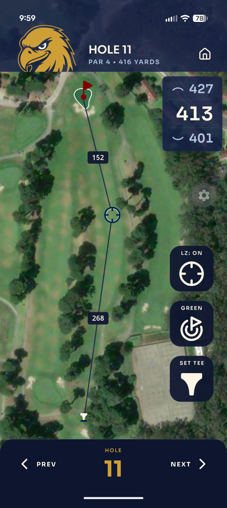

<div align="center">


# Eagle Eye

**A pocket golf rangefinder that doesn't need a signal.**

_Stand on the tee. Glance at your phone. Know the number._

<br />



</div>

---

## What it is

Eagle Eye is a personal Android golf rangefinder — a fast, offline distance app you sideload as an APK and take to the course. No subscription, no login, no cell service required. Just you, the GPS, and the green.

Point it at a hole and it tells you the **front, center, and back** of the green in yards — computed from your live position against real course geometry. Walk to your ball, glance down, hit your number.

Built solo, for one golfer's bag, with the discipline of something much bigger.

## Why it's different

⛳ **Truly offline.** Course data and map tiles (raster + vector, zoom 16–18) are downloaded ahead of time and stored on-device. Once you're on the first tee, airplane mode is fine.

🦅 **Front / center / back, done right.** Distances are measured to the _closest_ and _farthest_ points on the actual green polygon — not a single hand-dropped dot. The math lives in a pure geospatial module and is the same whether the green came from a bundled course, OSM, or a tap-to-fix synthesis.

🗺️ **Real satellite maps, on the trail.** Renders with MapLibre over offline satellite imagery, with native on-map labels for pins and landing zones.

📍 **Find Nearby.** Not at one of the bundled courses? Discover and install nearby courses straight from OpenStreetMap, right there in the parking lot.

🎯 **Tee-shot tracking.** A two-tap start→mark flow snapshots your GPS so you can see exactly how far that drive carried.

🔒 **Your data stays yours.** SQLite on the device is the single source of truth for your rounds and installed courses. Nothing leaves the phone.

## The home course

Eagle Eye ships pre-loaded with five Bay Area courses — **Presidio** (the home course), **Harding Park**, **Crystal Springs**, **Lincoln Park**, and **Peacock Gap** — so it works out of the box before you've downloaded anything.

## Tech stack

| Layer        | Choice                                                                 |
| ------------ | ---------------------------------------------------------------------- |
| App          | Expo (SDK 56) + React Native 0.85 + React 19, Expo Router (file-based) |
| Maps         | `@maplibre/maplibre-react-native` with offline tile packs              |
| Geospatial   | Turf.js, wrapped behind a pure `lib/geo` module                        |
| Storage      | SQLite via Drizzle ORM — source of truth for rounds + course install   |
| State        | Zustand                                                                |
| Type / style | TypeScript strict mode, in-house design system in `lib/theme.ts`       |

The codebase is organized by **domain concept, not by layer** — deep modules (`geo`, `course`, `round`, `tiles`, `shots`) each expose a single narrow interface, so a bug localizes to one module instead of smearing across the app. There's no test suite by design; the architecture _is_ the debugging aid.

## Getting started

> Requires a **custom dev client** — Eagle Eye uses native map modules and will **not** run in Expo Go.

```bash
npm install          # uses legacy-peer-deps (Expo 56 / RN 0.85 / React 19)
npm start            # Expo dev server
npm run android      # launch on a connected device / emulator
```

Handy scripts:

```bash
npm run lint                                 # ESLint + prettier
npm run format                               # prettier write
npm run db:generate                          # regenerate Drizzle migrations from lib/**/schema.ts
npm run build:course -- way/16650363 presidio  # Overpass → courses/<slug>.json
```

## Where to read more

- **`CONTEXT.md`** — the domain glossary (Course, Hole, Green, Pin, Round, Tee Shot…). These terms are used exactly, in code and docs.
- **`docs/PLANNING.md`** — phasing plan, tech-stack rationale, module table, data model, UX flows.
- **`docs/adr/`** — eight ADRs locking in the non-obvious calls (front/back via closest point, SQLite as source of truth, source-agnostic course data, offline tile packs, and more).
