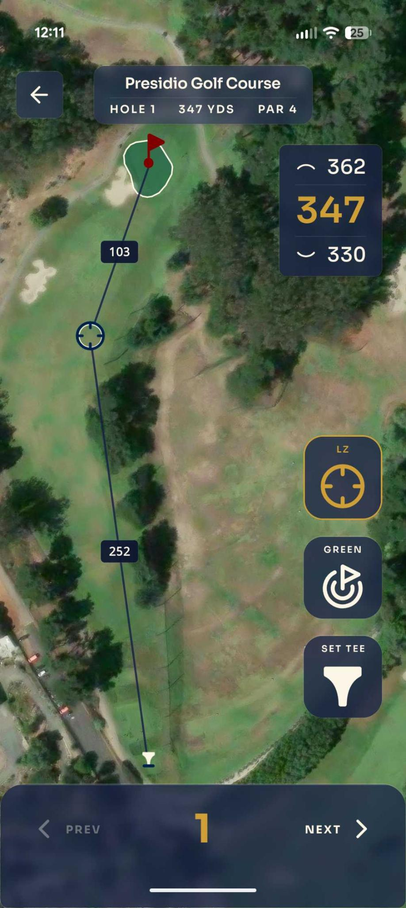
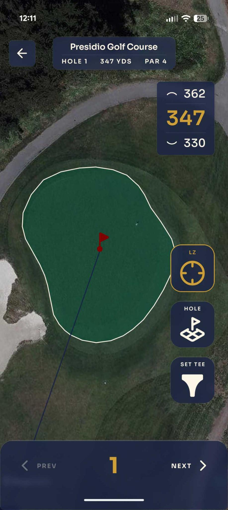

# UI Layout → Component Map (Hole View)

The hole view is the app's primary screen — a full-screen map under glass chrome.
This doc maps **what you see on screen** to **which component owns it**, so a visual
tweak can be traced to a single file. It complements the module table in
`PLANNING.md` (which maps domain capabilities to `lib/` modules); this one maps
_pixels_ to `components/hole/`.

 

> The small gear glyph mid-right in the screenshot is the Expo/Metro **dev-menu
> overlay**, not part of the app — it does not ship in a release build.

## Annotated layout

```
┌───────────────────────────────────────────────┐
│ 🦅  HOLE 11                          [ ⌂ ]     │  A  TopBar (variant="glass")
│     PAR 4 • 416 YARDS                          │
│ ─ ─ ─ ─ ─ ─ ─ ─ ─ ─ ─ ─ ─ ─ ─ ─ ─ ─ ─ ─ ─ ─ ─ │
│                                  ┌──────────┐  │
│                                  │ ⌃   427  │  │  C  HoleMeasurements
│           ╔══ green ══╗          │     413  │  │       └ FpbPanel
│            ⚑ pin                 │ ⌄   401  │  │          (back / PIN / front)
│           ┼ 152                  └──────────┘  │
│           │                                    │
│           │                       ◉  LZ: ON    │  D  HoleButtonStack
│          ┼ 268                    ◉  GREEN      │       (column-reverse:
│           │                       ◉  SET TEE   │        LZ ▸ Green ▸ Set Tee)
│           ▽ tee                                │
│                                                │  B  HoleMap (full-screen base)
│ ─ ─ ─ ─ ─ ─ ─ ─ ─ ─ ─ ─ ─ ─ ─ ─ ─ ─ ─ ─ ─ ─ ─ │
│   ‹ PREV          HOLE          NEXT ›         │  E  BottomDrawer (nav row)
│                    11                          │
└───────────────────────────────────────────────┘
                     ▲ tap "HOLE 11" → grid expands upward (F)
```

## Composition root

`HoleLayout.tsx` is pure composition — it stacks five absolutely-positioned
regions over the map and pulls nothing but a few header values from the scene:

```
HoleLayout
├─ HoleMap            B  full-screen MapLibre canvas + all on-map markers
├─ TopBar             A  glass header (title / subtitle / home action)
├─ HoleMeasurements   C  top-right F/G/B pill (+ tee-distance pill)
├─ HoleButtonStack    D  right-edge control buttons
├─ BottomDrawer       E+F bottom nav row + expandable hole grid
└─ TeeOverrideDialog  —  modal, hidden until "Set Tee" is confirmed
```

Z-order is render order: the map is painted first, every other region floats on
top of it. Layout uses absolute positioning keyed to safe-area insets, not flow.

## Region → file → ownership

| #   | On-screen region                                                  | Component                   | Owns                                                                    | Reads from scene                                                             |
| --- | ----------------------------------------------------------------- | --------------------------- | ----------------------------------------------------------------------- | ---------------------------------------------------------------------------- |
| A   | Glass header: logo, `HOLE n`, `PAR p • y YARDS`, home button      | `TopBar` (via `HoleLayout`) | Title/subtitle text, home navigation                                    | `currentHole`, `holeYards`                                                   |
| B   | Satellite map + tee / pin / LZ / "me" markers + LZ lines & labels | `HoleMap`                   | Camera framing, markers, tap handling (drop pin / drag LZ), LZ geometry | `currentHole`, `pin`, `position`, `teeLL`, `greenC`, `cameraMode`, `lzShown` |
| C   | Top-right F/G/B pill + tee-distance pill                          | `HoleMeasurements`          | Front/center/back distance math, tee-relative fallback                  | `position`, `pin`, `teeLL`, `greenC`, `currentHole`                          |
| D   | Right-edge buttons: `LZ`, `Green/Hole`, `Set Tee`                 | `HoleButtonStack`           | Camera-mode toggle, LZ toggle, opening the tee dialog                   | `cameraMode`, `lzShown`, `hasTeeOverride`, `teeBusy`, `currentHole.par`      |
| E   | Bottom nav: `‹ PREV`, `HOLE n`, `NEXT ›`/`CARD`                   | `BottomDrawer`              | Prev/next navigation, last-hole → scorecard                             | `prevHole`, `canAdvance`, `isLastHole`, `currentHole`                        |
| F   | Expandable 6-col hole grid (tap `HOLE n`)                         | `BottomDrawer` › `HoleGrid` | Animated expand, hole selection                                         | `course.holes`, `currentHole`                                                |
| —   | Tee-correction confirm modal                                      | `TeeOverrideDialog`         | Confirm/clear tee override, shows move distance                         | `teeDialogOpen`, `setTee`, `clearTee`, `position`, `hasTeeOverride`          |

## How regions get their data

Every region reads the same `HoleScene` context via `useHoleScene()` instead of
prop-drilling. `scene.tsx` (the `HoleSceneProvider`) is the single owner of:

- **GPS** — the `watchPositionAsync` subscription → `position`.
- **Derived geometry** — `teeLL`, `greenC`, `pin` (live pin override or green
  centroid), `holeYards`.
- **Cross-region toggles** — `cameraMode` (`hole`/`green`), `lzShown`.
- **Navigation** — `goPrev` / `goNext` / `selectHole`, plus `prev/next/isLast`.
- **Tee correction** — the dialog open/commit/clear lifecycle.

> Rule of thumb the code already follows: state that **more than one region**
> needs lives in `scene.tsx`; state only **one region** needs stays local to that
> region (e.g. F/G/B distance math lives in `HoleMeasurements`; LZ waypoint
> positions and camera framing live in `HoleMap`).

## Styling source of truth

Nothing here hardcodes color, spacing, or type — every value comes from
`lib/theme.ts` tokens (`colors`, `space`, `radius`, `type`, `shadows`, `fonts`).
The palette is generated from a handful of oklch "knob" bases at the top of
`theme.ts`; retheme by editing those, not the components. The glass panels are
**real frosted glass** (`components/GlassSurface.tsx`): a live `expo-blur`
backdrop blur of the map under a translucent navy fill (`colors.glassFill` /
`glassFillDark`), a hairline `outlineVariant` border, and a 1px cream top
highlight (`colors.glassHighlight`). The blur needs the map mounted with
`androidView="texture"` and a `blurTarget` threaded via `GlassRoot` /
`GlassBlurTarget` — see the header comment in `GlassSurface.tsx`.

See `UI_CRITIQUE.md` for an assessment of this layout and concrete suggestions.
